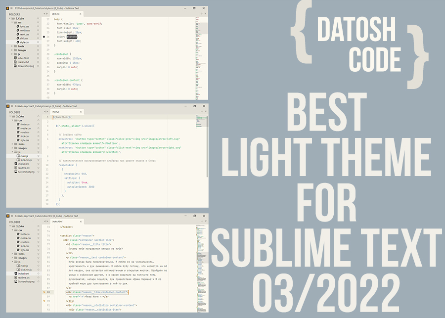

# datoshcode_light-color-theme_for-SublimeText
(en)
<h2>DatoshCode_  light-color-theme for "Sublime Text 3"</h2>

<ul>
  <li>Posted by: Andrei Ovcharov (Datosh Code) </li>
  <li>Development date: 14.02.2022. </li>
  <li>E-mail: datoshcode@gmail.com </li>
</ul>

<h3> Installation</h3> 

Setting the topic should not cause difficulties in most users, if follow the following instructions:

1.	You must unpack the contents of the archive to any place of your computer, such as on the desktop and copy the Datoshcode-Light-Color-Theme folder;
2.	Open the Sublime Text 3 Editor and go to "Preferences" on its panels and open "Browse Packages ..."
3.	A list of installed extensions will open. It is necessary among them to create a new folder named "Themes_user".
4.	Go to the "Themes_user" folder you created and insert the previously copied folder.

<h3> Setting </h3>

After the installation process is completed, it is recommended to restart the Sublime Text editor.

To select in the New Bright Thread Editor, you must go to "Preferences" and open "Select Color Scheme ..." Next, from the list of the proposed, you should select "datosh_code_light" and confirm by pressing the Enter key. After that, in the same place in "Preferences", you should open "Select Theme ..." and choose from the "Adaptive" list, also confirm your choice by pressing the Enter key.

(ru)
<h2>DatoshCode_  light-color-theme для текстового редактора "Sublime Text 3"</h2>

<ul>
  <li>Автор: Андрей Овчаров (Datosh Code) </li>
  <li>Дата разработки: 14.02.2022. </li>
  <li>E-mail: datoshcode@gmail.com </li>
</ul>

<h3> Установка темы </h3> 

Установка темы не должна вызвать трудности у большинства пользователей, если следовать следующим указаниям:

1.	Необходимо распаковать содержимое архива в любое место своего компьютера, например на рабочий стол и скопировать папку "datoshcode-light-color-theme";
2.	Откройте редактора Sublime Text 3 и на его панели перейдите в "Preferences" и откройте "Browse Packages…"
3.	Откроется перечень установленных расширений. Необходимо среди них создать новую папку с именем “Themes_user”.
4.	Перейдите в только что созданную вами папку "Themes_user" и вставьте скопированную ранее папку.

<h3> Настройка темы </h3>

После завершения процесса установки тем, рекомендуется перезагрузить текстовый редактор Sublime Text 3.

Для выбора в редакторе новой светлой темы, необходимо перейти в "Preferences" и открыть "Select Color Scheme…" Далее, с перечня предложенного, следует выбрать «Datosh_code_light» и подтвердить нажатием клавиши Enter. После этого, там же в "Preferences", следует открыть "Select Theme…" и выбрать с перечня "Adaptive", также подтвердить свой выбор нажатием клавиши Enter.

